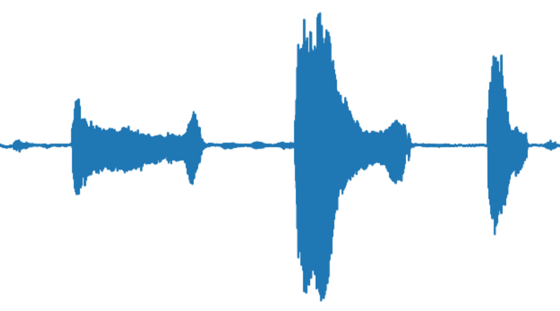

# pystream
Python audio streaming connected to external devices network or serial

* Sample files from [examples](https://python-sounddevice.readthedocs.io/en/0.4.1/examples.html)

# Python Audio devices
[python-sounddevice documentation](https://python-sounddevice.readthedocs.io/)

## Install

    pip install -r requirements.txt


## Play a wave file
[wave.py](wave.py)

    pyhton wave.py

## List devices
with command line

    python -m sounddevice

with script

```python
    devices = sd.query_devices()
    print(devices[0]["name"])
```

## Connect input to output with a stream
[mic_to_speaker.py](mic_to_speaker.py)

    python mic_to_speaker.py

## See the mic on live plot
[plot_input.py](plot_input.py)

    python plot_input.py



## Play sine tone
[play_sine.py](play_sine.py)

    python play_sine.py
# Reference
python play record sound libraries
* https://realpython.com/playing-and-recording-sound-python/
